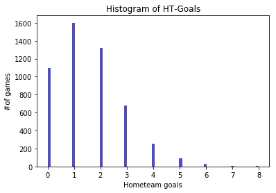
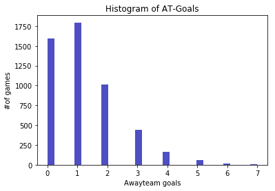
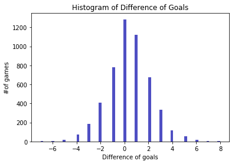
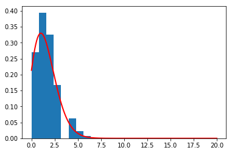
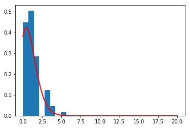

 HW-1 Tasks
 

Task-1


```python
import pandas as pd # Veri setleriyle calismak icin
import numpy as np  # Seriler ile islem yapmak icin
import seaborn as sns # Gorsellestirme icin
import matplotlib.pyplot as plt
%matplotlib inline
import plotly.plotly as py

```


```python
goals_df= pd.read_csv('goals.csv')
goals_df.head(5)
```


<div>
<style scoped>
    .dataframe tbody tr th:only-of-type {
        vertical-align: middle;
    }

    .dataframe tbody tr th {
        vertical-align: top;
    }

    .dataframe thead th {
        text-align: right;
    }
</style>
<table border="1" class="dataframe">
  <thead>
    <tr style="text-align: right;">
      <th></th>
      <th>match_id</th>
      <th>time</th>
      <th>home_scorer</th>
      <th>score</th>
      <th>away_scorer</th>
    </tr>
  </thead>
  <tbody>
    <tr>
      <th>0</th>
      <td>13327</td>
      <td>30</td>
      <td>Salah M.</td>
      <td>1 - 1</td>
      <td>NaN</td>
    </tr>
    <tr>
      <th>1</th>
      <td>13446</td>
      <td>35</td>
      <td>Colin M.</td>
      <td>1 - 0</td>
      <td>NaN</td>
    </tr>
    <tr>
      <th>2</th>
      <td>13446</td>
      <td>56</td>
      <td>NaN</td>
      <td>1 - 1</td>
      <td>Johnson D.</td>
    </tr>
    <tr>
      <th>3</th>
      <td>13446</td>
      <td>60</td>
      <td>NaN</td>
      <td>1 - 2</td>
      <td>Hugill J.</td>
    </tr>
    <tr>
      <th>4</th>
      <td>13446</td>
      <td>67</td>
      <td>NaN</td>
      <td>1 - 3</td>
      <td>Barkhuizen T.</td>
    </tr>
  </tbody>
</table>
</div>


```python
bets_df= pd.read_csv('bets.csv')
bets_df.head(5)
```


<div>
<style scoped>
    .dataframe tbody tr th:only-of-type {
        vertical-align: middle;
    }

    .dataframe tbody tr th {
        vertical-align: top;
    }

    .dataframe thead th {
        text-align: right;
    }
</style>
<table border="1" class="dataframe">
  <thead>
    <tr style="text-align: right;">
      <th></th>
      <th>match_id</th>
      <th>odd_bookmakers</th>
      <th>odd_epoch</th>
      <th>variable</th>
      <th>value</th>
    </tr>
  </thead>
  <tbody>
    <tr>
      <th>0</th>
      <td>146845</td>
      <td>BetOlimp</td>
      <td>1486301854</td>
      <td>odd_1</td>
      <td>1.96</td>
    </tr>
    <tr>
      <th>1</th>
      <td>151780</td>
      <td>10Bet</td>
      <td>1486314920</td>
      <td>odd_1</td>
      <td>2.15</td>
    </tr>
    <tr>
      <th>2</th>
      <td>151780</td>
      <td>18bet</td>
      <td>1486314920</td>
      <td>odd_1</td>
      <td>2.17</td>
    </tr>
    <tr>
      <th>3</th>
      <td>151780</td>
      <td>1xBet</td>
      <td>1486314920</td>
      <td>odd_1</td>
      <td>2.20</td>
    </tr>
    <tr>
      <th>4</th>
      <td>151780</td>
      <td>5Dimes</td>
      <td>1486314920</td>
      <td>odd_1</td>
      <td>2.23</td>
    </tr>
  </tbody>
</table>
</div>


```python
bets_df['P']=1/bets_df['value']
bets_df.head(5)
```


<div>
<style scoped>
    .dataframe tbody tr th:only-of-type {
        vertical-align: middle;
    }

    .dataframe tbody tr th {
        vertical-align: top;
    }

    .dataframe thead th {
        text-align: right;
    }
</style>
<table border="1" class="dataframe">
  <thead>
    <tr style="text-align: right;">
      <th></th>
      <th>match_id</th>
      <th>odd_bookmakers</th>
      <th>odd_epoch</th>
      <th>variable</th>
      <th>value</th>
      <th>P</th>
    </tr>
  </thead>
  <tbody>
    <tr>
      <th>0</th>
      <td>146845</td>
      <td>BetOlimp</td>
      <td>1486301854</td>
      <td>odd_1</td>
      <td>1.96</td>
      <td>0.510204</td>
    </tr>
    <tr>
      <th>1</th>
      <td>151780</td>
      <td>10Bet</td>
      <td>1486314920</td>
      <td>odd_1</td>
      <td>2.15</td>
      <td>0.465116</td>
    </tr>
    <tr>
      <th>2</th>
      <td>151780</td>
      <td>18bet</td>
      <td>1486314920</td>
      <td>odd_1</td>
      <td>2.17</td>
      <td>0.460829</td>
    </tr>
    <tr>
      <th>3</th>
      <td>151780</td>
      <td>1xBet</td>
      <td>1486314920</td>
      <td>odd_1</td>
      <td>2.20</td>
      <td>0.454545</td>
    </tr>
    <tr>
      <th>4</th>
      <td>151780</td>
      <td>5Dimes</td>
      <td>1486314920</td>
      <td>odd_1</td>
      <td>2.23</td>
      <td>0.448430</td>
    </tr>
  </tbody>
</table>
</div>


```python
odd_array =['odd_1','odd_x','odd_2']
bookmaker_array =['BetOlimp','10Bet','18bet','1xBet','5Dimes']
bets_reduced = bets_df.loc[(bets_df['odd_bookmakers'].isin(bookmaker_array)) & bets_df['variable'].isin(odd_array)]
bets_reduced.head()
```


<div>
<style scoped>
    .dataframe tbody tr th:only-of-type {
        vertical-align: middle;
    }

    .dataframe tbody tr th {
        vertical-align: top;
    }

    .dataframe thead th {
        text-align: right;
    }
</style>
<table border="1" class="dataframe">
  <thead>
    <tr style="text-align: right;">
      <th></th>
      <th>match_id</th>
      <th>odd_bookmakers</th>
      <th>odd_epoch</th>
      <th>variable</th>
      <th>value</th>
      <th>P</th>
    </tr>
  </thead>
  <tbody>
    <tr>
      <th>0</th>
      <td>146845</td>
      <td>BetOlimp</td>
      <td>1486301854</td>
      <td>odd_1</td>
      <td>1.96</td>
      <td>0.510204</td>
    </tr>
    <tr>
      <th>1</th>
      <td>151780</td>
      <td>10Bet</td>
      <td>1486314920</td>
      <td>odd_1</td>
      <td>2.15</td>
      <td>0.465116</td>
    </tr>
    <tr>
      <th>2</th>
      <td>151780</td>
      <td>18bet</td>
      <td>1486314920</td>
      <td>odd_1</td>
      <td>2.17</td>
      <td>0.460829</td>
    </tr>
    <tr>
      <th>3</th>
      <td>151780</td>
      <td>1xBet</td>
      <td>1486314920</td>
      <td>odd_1</td>
      <td>2.20</td>
      <td>0.454545</td>
    </tr>
    <tr>
      <th>4</th>
      <td>151780</td>
      <td>5Dimes</td>
      <td>1486314920</td>
      <td>odd_1</td>
      <td>2.23</td>
      <td>0.448430</td>
    </tr>
  </tbody>
</table>
</div>


```python
bets_reduced['variable'].unique()
```


    array(['odd_1', 'odd_x', 'odd_2'], dtype=object)


```python
booking_df= pd.read_csv('booking.csv')
booking_df.head(5)
```


<div>
<style scoped>
    .dataframe tbody tr th:only-of-type {
        vertical-align: middle;
    }

    .dataframe tbody tr th {
        vertical-align: top;
    }

    .dataframe thead th {
        text-align: right;
    }
</style>
<table border="1" class="dataframe">
  <thead>
    <tr style="text-align: right;">
      <th></th>
      <th>match_id</th>
      <th>time</th>
      <th>home_fault</th>
      <th>card</th>
      <th>away_fault</th>
    </tr>
  </thead>
  <tbody>
    <tr>
      <th>0</th>
      <td>13327</td>
      <td>90+3</td>
      <td>Can E.</td>
      <td>yellow card</td>
      <td>NaN</td>
    </tr>
    <tr>
      <th>1</th>
      <td>13329</td>
      <td>29</td>
      <td>Holebas J.</td>
      <td>yellow card</td>
      <td>NaN</td>
    </tr>
    <tr>
      <th>2</th>
      <td>13329</td>
      <td>40</td>
      <td>Doucoure A.</td>
      <td>yellow card</td>
      <td>NaN</td>
    </tr>
    <tr>
      <th>3</th>
      <td>13331</td>
      <td>33</td>
      <td>Cabaye Y.</td>
      <td>yellow card</td>
      <td>NaN</td>
    </tr>
    <tr>
      <th>4</th>
      <td>13331</td>
      <td>50</td>
      <td>Puncheon J.</td>
      <td>yellow card</td>
      <td>NaN</td>
    </tr>
  </tbody>
</table>
</div>


```python
matches_df= pd.read_csv('matches.csv')
matches_df.head(5)
```


<div>
<style scoped>
    .dataframe tbody tr th:only-of-type {
        vertical-align: middle;
    }

    .dataframe tbody tr th {
        vertical-align: top;
    }

    .dataframe thead th {
        text-align: right;
    }
</style>
<table border="1" class="dataframe">
  <thead>
    <tr style="text-align: right;">
      <th></th>
      <th>match_awayteam_id</th>
      <th>match_hometeam_id</th>
      <th>match_id</th>
      <th>epoch</th>
      <th>match_status</th>
      <th>match_live</th>
      <th>match_hometeam_name</th>
      <th>match_awayteam_name</th>
      <th>match_hometeam_score</th>
      <th>match_awayteam_score</th>
      <th>match_hometeam_halftime_score</th>
      <th>match_awayteam_halftime_score</th>
      <th>match_hometeam_extra_score</th>
      <th>match_awayteam_extra_score</th>
      <th>match_hometeam_penalty_score</th>
      <th>match_awayteam_penalty_score</th>
      <th>league_id</th>
    </tr>
  </thead>
  <tbody>
    <tr>
      <th>0</th>
      <td>7109</td>
      <td>7097</td>
      <td>41196</td>
      <td>1505559600</td>
      <td>Finished</td>
      <td>0</td>
      <td>Levante</td>
      <td>Valencia</td>
      <td>1.0</td>
      <td>1.0</td>
      <td>1.0</td>
      <td>1.0</td>
      <td>1.0</td>
      <td>1.0</td>
      <td>NaN</td>
      <td>NaN</td>
      <td>468</td>
    </tr>
    <tr>
      <th>1</th>
      <td>2614</td>
      <td>2619</td>
      <td>13331</td>
      <td>1505561400</td>
      <td>Finished</td>
      <td>0</td>
      <td>Crystal Palace</td>
      <td>Southampton</td>
      <td>0.0</td>
      <td>1.0</td>
      <td>0.0</td>
      <td>1.0</td>
      <td>0.0</td>
      <td>1.0</td>
      <td>NaN</td>
      <td>NaN</td>
      <td>148</td>
    </tr>
    <tr>
      <th>2</th>
      <td>3224</td>
      <td>3238</td>
      <td>17683</td>
      <td>1505568600</td>
      <td>Finished</td>
      <td>0</td>
      <td>Eintracht Frankfurt</td>
      <td>FC Augsburg</td>
      <td>1.0</td>
      <td>2.0</td>
      <td>0.0</td>
      <td>1.0</td>
      <td>0.0</td>
      <td>1.0</td>
      <td>NaN</td>
      <td>NaN</td>
      <td>195</td>
    </tr>
    <tr>
      <th>3</th>
      <td>3235</td>
      <td>3223</td>
      <td>17684</td>
      <td>1505568600</td>
      <td>Finished</td>
      <td>0</td>
      <td>SV Werder Bremen</td>
      <td>Schalke</td>
      <td>1.0</td>
      <td>2.0</td>
      <td>1.0</td>
      <td>1.0</td>
      <td>1.0</td>
      <td>1.0</td>
      <td>NaN</td>
      <td>NaN</td>
      <td>195</td>
    </tr>
    <tr>
      <th>4</th>
      <td>3237</td>
      <td>3225</td>
      <td>17682</td>
      <td>1505568600</td>
      <td>Finished</td>
      <td>0</td>
      <td>Bayern Munich</td>
      <td>1. FSV Mainz 05</td>
      <td>4.0</td>
      <td>0.0</td>
      <td>2.0</td>
      <td>0.0</td>
      <td>2.0</td>
      <td>0.0</td>
      <td>NaN</td>
      <td>NaN</td>
      <td>195</td>
    </tr>
  </tbody>
</table>
</div>


```python
matches_df.info()
```

    <class 'pandas.core.frame.DataFrame'>
    RangeIndex: 5162 entries, 0 to 5161
    Data columns (total 17 columns):
    match_awayteam_id                5162 non-null int64
    match_hometeam_id                5162 non-null int64
    match_id                         5162 non-null int64
    epoch                            5162 non-null int64
    match_status                     5074 non-null object
    match_live                       5162 non-null int64
    match_hometeam_name              5162 non-null object
    match_awayteam_name              5162 non-null object
    match_hometeam_score             5074 non-null float64
    match_awayteam_score             5074 non-null float64
    match_hometeam_halftime_score    4712 non-null float64
    match_awayteam_halftime_score    4712 non-null float64
    match_hometeam_extra_score       4712 non-null float64
    match_awayteam_extra_score       4712 non-null float64
    match_hometeam_penalty_score     0 non-null float64
    match_awayteam_penalty_score     0 non-null float64
    league_id                        5162 non-null int64
    dtypes: float64(8), int64(6), object(3)
    memory usage: 685.7+ KB


```python
stats_df= pd.read_csv('stats.csv')
stats_df.head(5)
```


<div>
<style scoped>
    .dataframe tbody tr th:only-of-type {
        vertical-align: middle;
    }

    .dataframe tbody tr th {
        vertical-align: top;
    }

    .dataframe thead th {
        text-align: right;
    }
</style>
<table border="1" class="dataframe">
  <thead>
    <tr style="text-align: right;">
      <th></th>
      <th>match_id</th>
      <th>home_BallPossession</th>
      <th>home_CornerKicks</th>
      <th>home_Fouls</th>
      <th>home_GoalAttempts</th>
      <th>home_GoalkeeperSaves</th>
      <th>home_Offsides</th>
      <th>home_ShotsoffGoal</th>
      <th>home_ShotsonGoal</th>
      <th>home_YellowCards</th>
      <th>...</th>
      <th>home_GoalKicks</th>
      <th>away_GoalKicks</th>
      <th>home_DistanceCovered(metres)</th>
      <th>away_DistanceCovered(metres)</th>
      <th>home_PassSuccess%</th>
      <th>away_PassSuccess%</th>
      <th>home_Attacks</th>
      <th>home_DangerousAttacks</th>
      <th>away_Attacks</th>
      <th>away_DangerousAttacks</th>
    </tr>
  </thead>
  <tbody>
    <tr>
      <th>0</th>
      <td>13327</td>
      <td>71%</td>
      <td>12.0</td>
      <td>7.0</td>
      <td>35.0</td>
      <td>3.0</td>
      <td>1.0</td>
      <td>14.0</td>
      <td>9.0</td>
      <td>1.0</td>
      <td>...</td>
      <td>NaN</td>
      <td>NaN</td>
      <td>NaN</td>
      <td>NaN</td>
      <td>NaN</td>
      <td>NaN</td>
      <td>NaN</td>
      <td>NaN</td>
      <td>NaN</td>
      <td>NaN</td>
    </tr>
    <tr>
      <th>1</th>
      <td>13329</td>
      <td>33%</td>
      <td>3.0</td>
      <td>8.0</td>
      <td>7.0</td>
      <td>4.0</td>
      <td>2.0</td>
      <td>5.0</td>
      <td>1.0</td>
      <td>2.0</td>
      <td>...</td>
      <td>NaN</td>
      <td>NaN</td>
      <td>NaN</td>
      <td>NaN</td>
      <td>NaN</td>
      <td>NaN</td>
      <td>NaN</td>
      <td>NaN</td>
      <td>NaN</td>
      <td>NaN</td>
    </tr>
    <tr>
      <th>2</th>
      <td>13331</td>
      <td>45%</td>
      <td>5.0</td>
      <td>14.0</td>
      <td>14.0</td>
      <td>3.0</td>
      <td>0.0</td>
      <td>9.0</td>
      <td>3.0</td>
      <td>5.0</td>
      <td>...</td>
      <td>NaN</td>
      <td>NaN</td>
      <td>NaN</td>
      <td>NaN</td>
      <td>NaN</td>
      <td>NaN</td>
      <td>NaN</td>
      <td>NaN</td>
      <td>NaN</td>
      <td>NaN</td>
    </tr>
    <tr>
      <th>3</th>
      <td>13446</td>
      <td>51%</td>
      <td>7.0</td>
      <td>7.0</td>
      <td>6.0</td>
      <td>3.0</td>
      <td>0.0</td>
      <td>4.0</td>
      <td>2.0</td>
      <td>2.0</td>
      <td>...</td>
      <td>NaN</td>
      <td>NaN</td>
      <td>NaN</td>
      <td>NaN</td>
      <td>NaN</td>
      <td>NaN</td>
      <td>NaN</td>
      <td>NaN</td>
      <td>NaN</td>
      <td>NaN</td>
    </tr>
    <tr>
      <th>4</th>
      <td>13447</td>
      <td>49%</td>
      <td>3.0</td>
      <td>18.0</td>
      <td>20.0</td>
      <td>1.0</td>
      <td>1.0</td>
      <td>8.0</td>
      <td>6.0</td>
      <td>3.0</td>
      <td>...</td>
      <td>NaN</td>
      <td>NaN</td>
      <td>NaN</td>
      <td>NaN</td>
      <td>NaN</td>
      <td>NaN</td>
      <td>NaN</td>
      <td>NaN</td>
      <td>NaN</td>
      <td>NaN</td>
    </tr>
  </tbody>
</table>
<p>5 rows × 43 columns</p>
</div>


```python
df= pd.read_csv('goals.csv')
df.head(5)
```


<div>
<style scoped>
    .dataframe tbody tr th:only-of-type {
        vertical-align: middle;
    }

    .dataframe tbody tr th {
        vertical-align: top;
    }

    .dataframe thead th {
        text-align: right;
    }
</style>
<table border="1" class="dataframe">
  <thead>
    <tr style="text-align: right;">
      <th></th>
      <th>match_id</th>
      <th>time</th>
      <th>home_scorer</th>
      <th>score</th>
      <th>away_scorer</th>
    </tr>
  </thead>
  <tbody>
    <tr>
      <th>0</th>
      <td>13327</td>
      <td>30</td>
      <td>Salah M.</td>
      <td>1 - 1</td>
      <td>NaN</td>
    </tr>
    <tr>
      <th>1</th>
      <td>13446</td>
      <td>35</td>
      <td>Colin M.</td>
      <td>1 - 0</td>
      <td>NaN</td>
    </tr>
    <tr>
      <th>2</th>
      <td>13446</td>
      <td>56</td>
      <td>NaN</td>
      <td>1 - 1</td>
      <td>Johnson D.</td>
    </tr>
    <tr>
      <th>3</th>
      <td>13446</td>
      <td>60</td>
      <td>NaN</td>
      <td>1 - 2</td>
      <td>Hugill J.</td>
    </tr>
    <tr>
      <th>4</th>
      <td>13446</td>
      <td>67</td>
      <td>NaN</td>
      <td>1 - 3</td>
      <td>Barkhuizen T.</td>
    </tr>
  </tbody>
</table>
</div>


```python
#df.groupby(df['match_id']).head(5)

```


```python
df1=pd.read_csv('matches.csv')
df1.head(5)
```


<div>
<style scoped>
    .dataframe tbody tr th:only-of-type {
        vertical-align: middle;
    }

    .dataframe tbody tr th {
        vertical-align: top;
    }

    .dataframe thead th {
        text-align: right;
    }
</style>
<table border="1" class="dataframe">
  <thead>
    <tr style="text-align: right;">
      <th></th>
      <th>match_awayteam_id</th>
      <th>match_hometeam_id</th>
      <th>match_id</th>
      <th>epoch</th>
      <th>match_status</th>
      <th>match_live</th>
      <th>match_hometeam_name</th>
      <th>match_awayteam_name</th>
      <th>match_hometeam_score</th>
      <th>match_awayteam_score</th>
      <th>match_hometeam_halftime_score</th>
      <th>match_awayteam_halftime_score</th>
      <th>match_hometeam_extra_score</th>
      <th>match_awayteam_extra_score</th>
      <th>match_hometeam_penalty_score</th>
      <th>match_awayteam_penalty_score</th>
      <th>league_id</th>
    </tr>
  </thead>
  <tbody>
    <tr>
      <th>0</th>
      <td>7109</td>
      <td>7097</td>
      <td>41196</td>
      <td>1505559600</td>
      <td>Finished</td>
      <td>0</td>
      <td>Levante</td>
      <td>Valencia</td>
      <td>1.0</td>
      <td>1.0</td>
      <td>1.0</td>
      <td>1.0</td>
      <td>1.0</td>
      <td>1.0</td>
      <td>NaN</td>
      <td>NaN</td>
      <td>468</td>
    </tr>
    <tr>
      <th>1</th>
      <td>2614</td>
      <td>2619</td>
      <td>13331</td>
      <td>1505561400</td>
      <td>Finished</td>
      <td>0</td>
      <td>Crystal Palace</td>
      <td>Southampton</td>
      <td>0.0</td>
      <td>1.0</td>
      <td>0.0</td>
      <td>1.0</td>
      <td>0.0</td>
      <td>1.0</td>
      <td>NaN</td>
      <td>NaN</td>
      <td>148</td>
    </tr>
    <tr>
      <th>2</th>
      <td>3224</td>
      <td>3238</td>
      <td>17683</td>
      <td>1505568600</td>
      <td>Finished</td>
      <td>0</td>
      <td>Eintracht Frankfurt</td>
      <td>FC Augsburg</td>
      <td>1.0</td>
      <td>2.0</td>
      <td>0.0</td>
      <td>1.0</td>
      <td>0.0</td>
      <td>1.0</td>
      <td>NaN</td>
      <td>NaN</td>
      <td>195</td>
    </tr>
    <tr>
      <th>3</th>
      <td>3235</td>
      <td>3223</td>
      <td>17684</td>
      <td>1505568600</td>
      <td>Finished</td>
      <td>0</td>
      <td>SV Werder Bremen</td>
      <td>Schalke</td>
      <td>1.0</td>
      <td>2.0</td>
      <td>1.0</td>
      <td>1.0</td>
      <td>1.0</td>
      <td>1.0</td>
      <td>NaN</td>
      <td>NaN</td>
      <td>195</td>
    </tr>
    <tr>
      <th>4</th>
      <td>3237</td>
      <td>3225</td>
      <td>17682</td>
      <td>1505568600</td>
      <td>Finished</td>
      <td>0</td>
      <td>Bayern Munich</td>
      <td>1. FSV Mainz 05</td>
      <td>4.0</td>
      <td>0.0</td>
      <td>2.0</td>
      <td>0.0</td>
      <td>2.0</td>
      <td>0.0</td>
      <td>NaN</td>
      <td>NaN</td>
      <td>195</td>
    </tr>
  </tbody>
</table>
</div>


```python

x=df1['match_hometeam_score']
x=x[x.notna()]
plt.hist(x, range=(x.min(), x.max()), bins='auto', color='#0504aa',
                            alpha=0.7)
plt.xlabel('Home Goals')
plt.ylabel('Number of games')
plt.title('Histogram of Home Goals')
#plt.text(60, .025, r'$\mu=100,\ \sigma=15$')

```


    Text(0.5,1,'Histogram of HT-Goals')





```python
k=df1['match_awayteam_score']
k=k[k.notna()]
plt.hist(k, range=(k.min(), k.max()), bins='auto', color='#0504aa',
                            alpha=0.7)
plt.xlabel('Away Goals')
plt.ylabel('Number of games')
plt.title('Histogram of Away Goals')
```


    Text(0.5,1,'Histogram of AT-Goals')





```python
df1['score_difference']=df1['match_hometeam_score']-df1['match_awayteam_score']
m=df1['score_difference']
m=m[m.notna()]
plt.hist(m, range=(m.min(), m.max()), bins='auto', color='#0504aa',
                            alpha=0.7)
plt.xlabel('Home Score(goals)– Away Score(goals)')
plt.ylabel('Number of games')
plt.title('Histogram of Difference of Goals')
```


    Text(0.5,1,'Histogram of Difference of Goals')





```python
df1.head(5)
```


<div>
<style scoped>
    .dataframe tbody tr th:only-of-type {
        vertical-align: middle;
    }

    .dataframe tbody tr th {
        vertical-align: top;
    }

    .dataframe thead th {
        text-align: right;
    }
</style>
<table border="1" class="dataframe">
  <thead>
    <tr style="text-align: right;">
      <th></th>
      <th>match_awayteam_id</th>
      <th>match_hometeam_id</th>
      <th>match_id</th>
      <th>epoch</th>
      <th>match_status</th>
      <th>match_live</th>
      <th>match_hometeam_name</th>
      <th>match_awayteam_name</th>
      <th>match_hometeam_score</th>
      <th>match_awayteam_score</th>
      <th>match_hometeam_halftime_score</th>
      <th>match_awayteam_halftime_score</th>
      <th>match_hometeam_extra_score</th>
      <th>match_awayteam_extra_score</th>
      <th>match_hometeam_penalty_score</th>
      <th>match_awayteam_penalty_score</th>
      <th>league_id</th>
      <th>score_difference</th>
    </tr>
  </thead>
  <tbody>
    <tr>
      <th>0</th>
      <td>7109</td>
      <td>7097</td>
      <td>41196</td>
      <td>1505559600</td>
      <td>Finished</td>
      <td>0</td>
      <td>Levante</td>
      <td>Valencia</td>
      <td>1.0</td>
      <td>1.0</td>
      <td>1.0</td>
      <td>1.0</td>
      <td>1.0</td>
      <td>1.0</td>
      <td>NaN</td>
      <td>NaN</td>
      <td>468</td>
      <td>0.0</td>
    </tr>
    <tr>
      <th>1</th>
      <td>2614</td>
      <td>2619</td>
      <td>13331</td>
      <td>1505561400</td>
      <td>Finished</td>
      <td>0</td>
      <td>Crystal Palace</td>
      <td>Southampton</td>
      <td>0.0</td>
      <td>1.0</td>
      <td>0.0</td>
      <td>1.0</td>
      <td>0.0</td>
      <td>1.0</td>
      <td>NaN</td>
      <td>NaN</td>
      <td>148</td>
      <td>-1.0</td>
    </tr>
    <tr>
      <th>2</th>
      <td>3224</td>
      <td>3238</td>
      <td>17683</td>
      <td>1505568600</td>
      <td>Finished</td>
      <td>0</td>
      <td>Eintracht Frankfurt</td>
      <td>FC Augsburg</td>
      <td>1.0</td>
      <td>2.0</td>
      <td>0.0</td>
      <td>1.0</td>
      <td>0.0</td>
      <td>1.0</td>
      <td>NaN</td>
      <td>NaN</td>
      <td>195</td>
      <td>-1.0</td>
    </tr>
    <tr>
      <th>3</th>
      <td>3235</td>
      <td>3223</td>
      <td>17684</td>
      <td>1505568600</td>
      <td>Finished</td>
      <td>0</td>
      <td>SV Werder Bremen</td>
      <td>Schalke</td>
      <td>1.0</td>
      <td>2.0</td>
      <td>1.0</td>
      <td>1.0</td>
      <td>1.0</td>
      <td>1.0</td>
      <td>NaN</td>
      <td>NaN</td>
      <td>195</td>
      <td>-1.0</td>
    </tr>
    <tr>
      <th>4</th>
      <td>3237</td>
      <td>3225</td>
      <td>17682</td>
      <td>1505568600</td>
      <td>Finished</td>
      <td>0</td>
      <td>Bayern Munich</td>
      <td>1. FSV Mainz 05</td>
      <td>4.0</td>
      <td>0.0</td>
      <td>2.0</td>
      <td>0.0</td>
      <td>2.0</td>
      <td>0.0</td>
      <td>NaN</td>
      <td>NaN</td>
      <td>195</td>
      <td>4.0</td>
    </tr>
  </tbody>
</table>
</div>


```python
from scipy.stats import poisson
```


```python
mu=x.mean()
mu
```


    1.5709499408750494


```python
#plt.plot( x, poisson.pmf(x,mu), 'r-' )
```


```python
from scipy import stats
```


```python
from scipy.optimize import curve_fit
from scipy.misc import factorial


# get poisson deviated random numbers ---> here is x

# the bins should be of integer width, because poisson is an integer distribution
entries, bin_edges, patches = plt.hist(x, range=[x.min(), x.max()], normed=True)

# calculate binmiddles
bin_middles = 0.5*(bin_edges[1:] + bin_edges[:-1])

# poisson function, parameter lamb is the fit parameter
def poisson(k, lamb):
    return (lamb**k/factorial(k)) * np.exp(-lamb)

# fit with curve_fit
parameters, cov_matrix = curve_fit(poisson, bin_middles, entries) 

# plot poisson-deviation with fitted parameter
x_plot = np.linspace(0, 20, 1000)

plt.plot(x_plot, poisson(x_plot, *parameters), 'r-', lw=2)
plt.show()
```

    /Users/yusufisik/anaconda3/lib/python3.6/site-packages/matplotlib/axes/_axes.py:6462: UserWarning:
    
    The 'normed' kwarg is deprecated, and has been replaced by the 'density' kwarg.
    
    /Users/yusufisik/anaconda3/lib/python3.6/site-packages/ipykernel_launcher.py:15: DeprecationWarning:
    
    `factorial` is deprecated!
    Importing `factorial` from scipy.misc is deprecated in scipy 1.0.0. Use `scipy.special.factorial` instead.
    





```python
entries, bin_edges, patches = plt.hist(k, range=[k.min(), k.max()], normed=True)
bin_middles = 0.5*(bin_edges[1:] + bin_edges[:-1])
parameters, cov_matrix = curve_fit(poisson, bin_middles, entries)

x_plot = np.linspace(0, 20, 1000)

plt.plot(x_plot, poisson(x_plot, *parameters), 'r-', lw=2)
plt.show()
```

    /Users/yusufisik/anaconda3/lib/python3.6/site-packages/matplotlib/axes/_axes.py:6462: UserWarning:
    
    The 'normed' kwarg is deprecated, and has been replaced by the 'density' kwarg.
    
    /Users/yusufisik/anaconda3/lib/python3.6/site-packages/ipykernel_launcher.py:15: DeprecationWarning:
    
    `factorial` is deprecated!
    Importing `factorial` from scipy.misc is deprecated in scipy 1.0.0. Use `scipy.special.factorial` instead.
    




